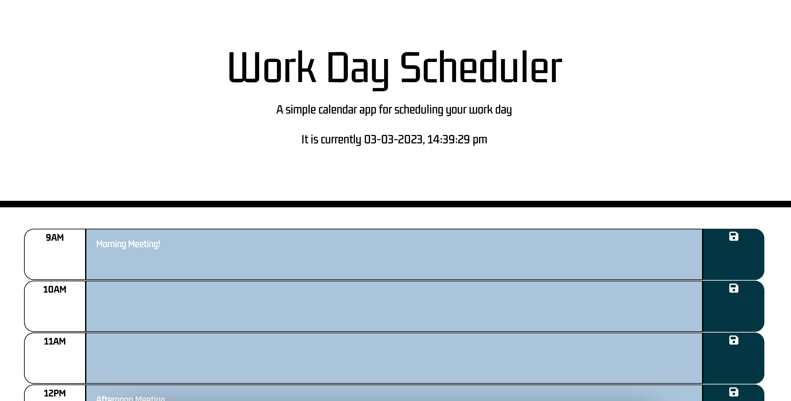
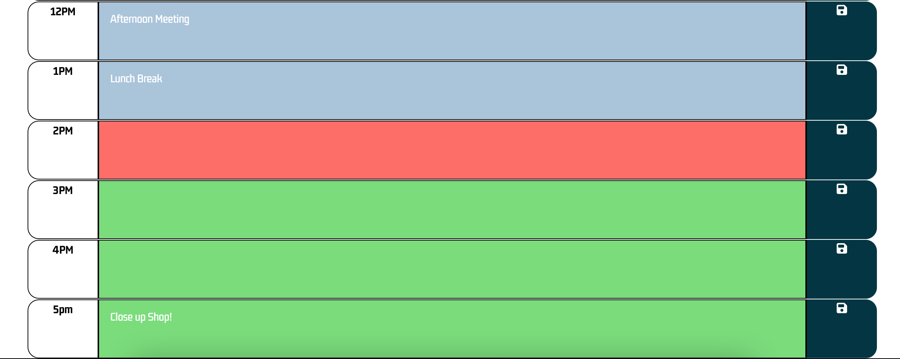

# Module 5 Challend: Work Scheduler


## User Story

```md
AS AN employee with a busy schedule
I WANT to add important events to a daily planner
SO THAT I can manage my time effectively
```

## Acceptance Criteria

```md
GIVEN I am using a daily planner to create a schedule
WHEN I open the planner
THEN the current day is displayed at the top of the calendar
WHEN I scroll down
THEN I am presented with timeblocks for standard business hours
WHEN I view the timeblocks for that day
THEN each timeblock is color coded to indicate whether it is in the past, present, or future
WHEN I click into a timeblock
THEN I can enter an event
WHEN I click the save button for that timeblock
THEN the text for that event is saved in local storage
WHEN I refresh the page
THEN the saved events persist
```

## Usage

Upon entering the webpage, you are greeted with your date and time as well as a few blocks for your work day (from 9 AM to 5 PM). When you click into the block, you will find that you can type in it. You can enter an event, such as a meeting. If you do not hit the save button, then you will lose any information you typed upon refreshinf. However, if you click on the little save button on the side then you will find that even upon refreshing the text that you inputted is still there!

## Screenshot




## Deployed Page

The webpage has been deployed at: https://bobascript.github.io/5-work-scheduler/
